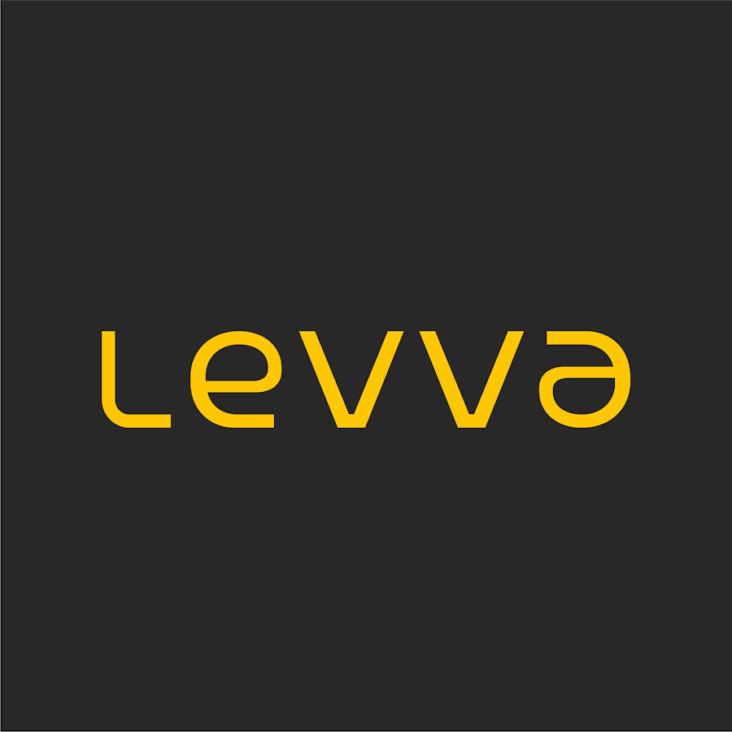
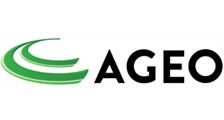
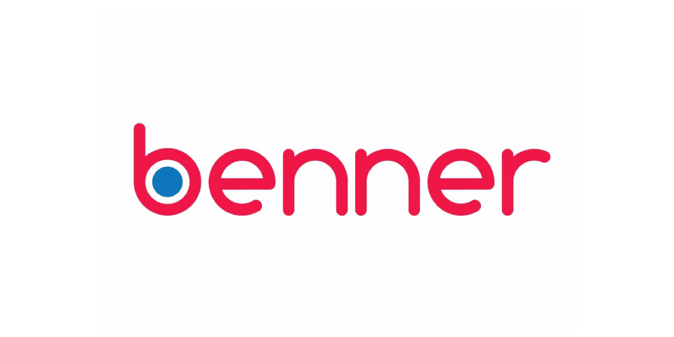

# Empresas por onde passei.

         

 

## Formação Acadêmica

Sistemas de Informação - Universidade Anhembi Morumbi - São Paulo/SP/
Conclusão- 2020

  

MBA - Engenharia de Software (Em andamento) - Conclusão em 2025

 

## Contatos
* Brasileiro
* São Paulo/SP
* (11) 94841-5274
* davidpereira248@gmail.com
* www.linkedin.com/in/davidlfp

