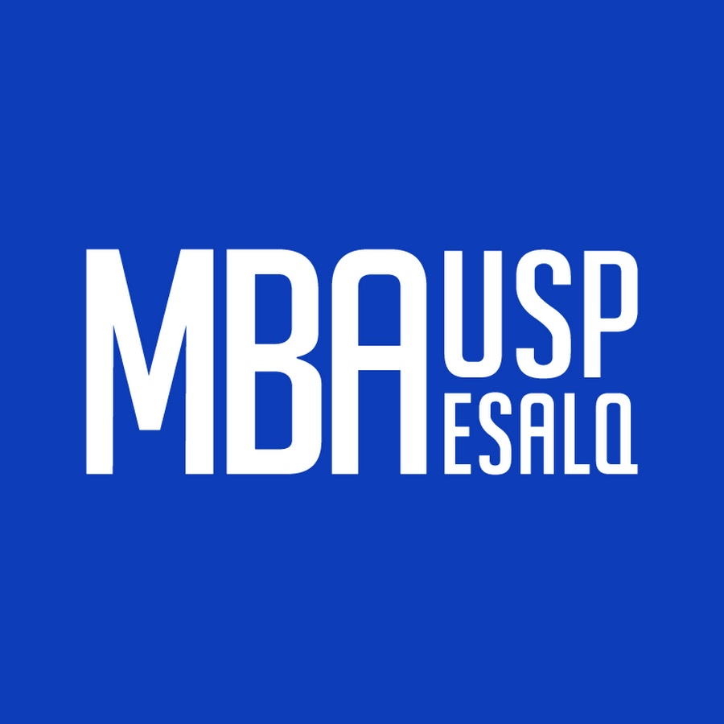
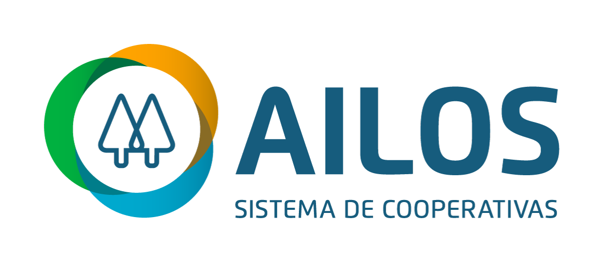
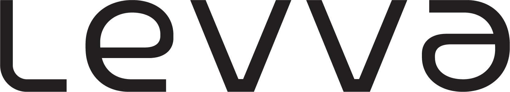
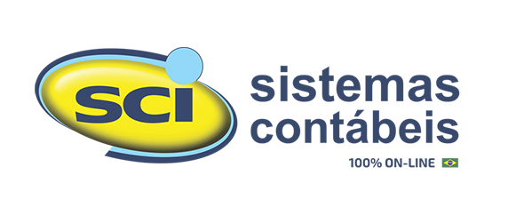
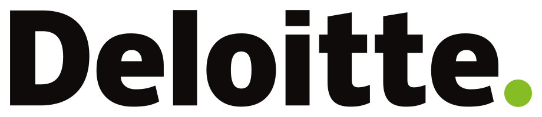
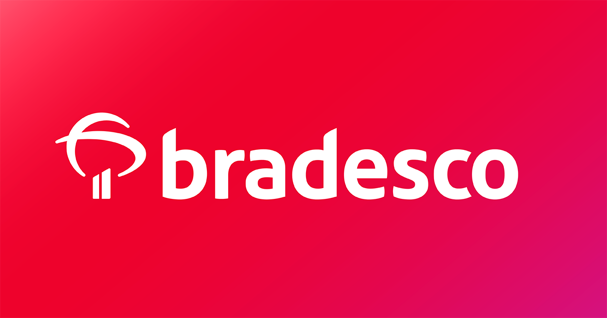
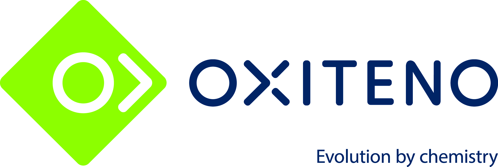
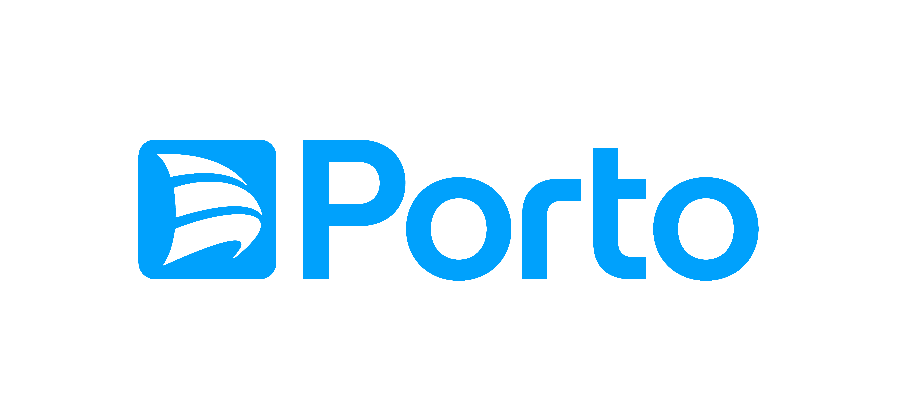

<h1 align="center #0969DA David Luis Fonseca Pereira </h1>

Sou um Product Owner apaixonado por criar soluções inovadoras e de alto impacto para os clientes. Atualmente, estou cursando MBA em Engenharia de Software na USP/ESALQ e Especialização em Governança de Tecnologia da Informação na UNICAMP (trancado). Tenho bacharelado em Sistemas de Informação pela Universidade Anhembi Morumbi. Possuo as certificações SCRUM MASTER, SAP FUNCIONAL R/3 Foundations e Java completo 2020 programação orientada a objetos + projeto.

Minha última experiência foi como Product Owner na Cooperativa Central Ailos, onde fui responsável por gerenciar o produto PLD/FT, uma solução para prevenção à lavagem de dinheiro e financiamento ao terrorismo. Lá, eu trabalhei com as equipes de desenvolvimento, design, UX, negócio e compliance, utilizando metodologias ágeis, OKRs, Azure DevOps e ferramentas como eGuardian, Bacen, Coaf, Siscoaf, Kn1, Calris, Ailos+ e Mulesoft. Contribuí para o aumento da qualidade, segurança e conformidade do produto, bem como para a melhoria da experiência do usuário e dos indicadores de negócio. Antes disso, fui Product Owner na levva e na SCI Sistemas Contábeis, onde desenvolvi produtos voltados para o mercado contábil e financeiro, aplicando técnicas de growth hacking, análise de métricas e inovação. Meu objetivo é continuar aprendendo e evoluindo como profissional, e fazer parte de uma equipe engajada, colaborativa e diversa, que busca entregar valor e satisfação aos clientes.

## Contatos
 
 :fire: Tenho disponibilidade para atuar presencialmente nas cidade de Florianópolis e São Paulo - São Paulo. 

 |Nacionalidade|Cidade|Telefone|E-mail|Linkedin|
| -------- | -------- | -------- |-------- | -------- |
|Brasileiro|São Paulo|(11) 94841-5274|davidpereira248@gmail.com|<a href="http://www.linkedin.com/in/davidlfp" target="_blank">Acesse meu Linkedin</a>

## Formação Acadêmica

Sistemas de Informação - Universidade Anhembi Morumbi - São Paulo/SP/
Conclusão- 2020

  

MBA - Engenharia de Software (Em andamento) - Conclusão 2025

 

## Empresas por onde passei.

       

 

